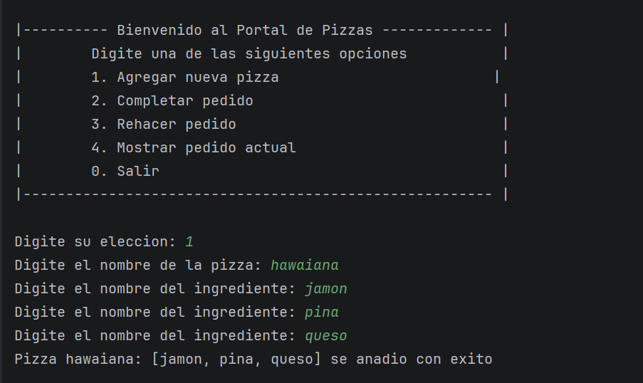
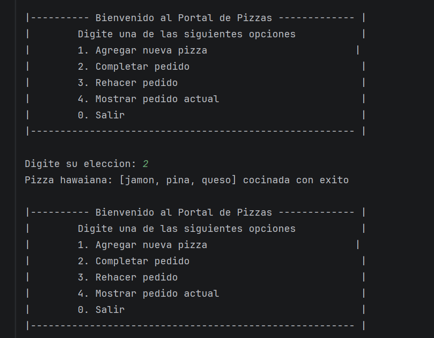
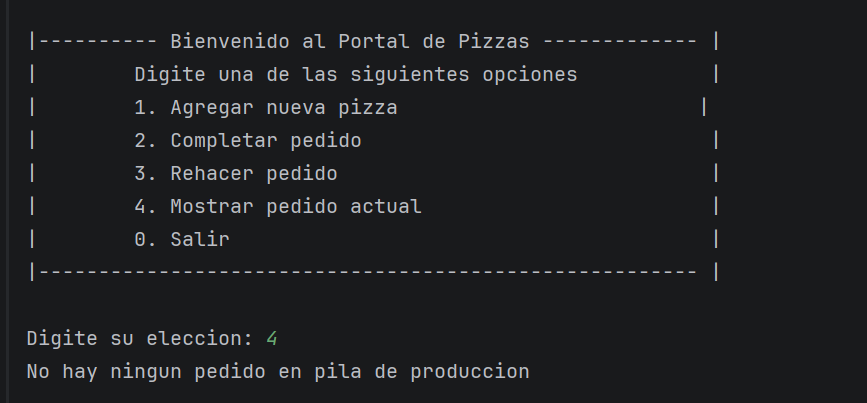
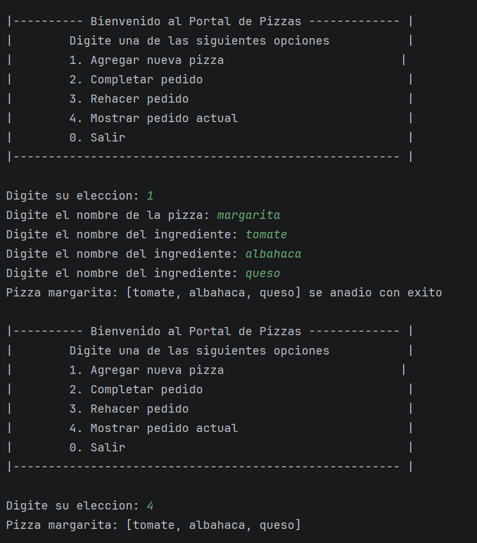
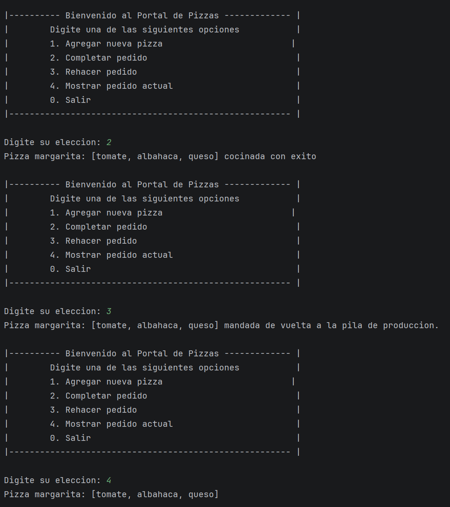

- Link github: https://github.com/saldaandres/proyecto_pilas_estructura_datos
- Video: https://drive.google.com/file/d/1tKIN4POYE2g8FJtnQNkHUc9V6ZOtGv-q/view?usp=drive_link

# Proyecto de Pilas - Curso Estructuras de Datos

El proyecto pretende simular un sistema de gestion de pedidos en una pizzeria y con tal fin se 
crean 5 clases en Java para modelar la situacion.

## Pizza y Nodo
La clase Pizza es la unidad basica del programa y modela una pizza con sus respectivos ingredientes, 
asi como un metodo para imprimirlas de manera amigable para el usuario. El nodo por su parte es un nodo 
que tiene una referencia a la pizza que estaba en la cima de pedidos anteriormente.

## PilaPizza y GestorPedidos
Modela la estructura de datos de una pila con los metodos basicos para insertar, quitar y revisar la 
pizza que se encuentra en la cima de la pila. Por su parte, GestorPedidos controla la logica de como
funciona el flujo de las pizzas en el negocio permitiendo crear las pizzas y moverlas entre pila de pizzas
por producir y la pila de pizzas completadas.

## Menu
Este es el metodo main del proyecto con el interactua el usuario, dependiendo de sus elecciones
se ejecutaran los diferentes metodos controlando el flujo por medio de una estructura de switch.

# Instrucciones de ejecucion
El proyecto se corre ejecutando el metodo main en el archivo Menu.java. De ahi en adelante, basta con digitar el
numero asociado con la funcion que queremos de acuerdo al menu desplegado en la consola, y en caso que deseemos
agregar una nueva pizza tambien debemos ingresar su nombre y sus 3 ingredientes por teclado.

## Flujo del programa

### Se solicitan los datos de la pizza al usuario y se anade la pizza a la pila de pedidos

### Se completa la primera pizza y se manda a la pila de completados

### Se trata de mostrar el pedido actual cuando pedidos esta vacio

### Despues de anadir otra pizza, se muestra el pedido actual

### Se completa un pedido y se manda de vuelta a la pila de produccion, se valida que sea de nuevo el pedido actual en 
### la cima

